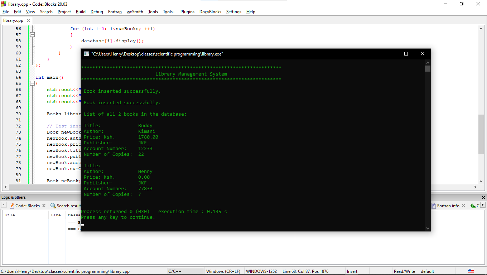

# Library Management System

This is a simple library management system implemented in C++. It allows users to maintain an inventory of books in a library.

## Features

- Insert new book records into the database.
- Display a list of all books in the database.

## Illustration



## Requirements

- C++ compiler (e.g., g++)
- Terminal or command prompt.
- Code Blocks or any C++ IDE.

## Installation

1. Clone the repository:
   
   ```bash
   git clone https://github.com/H3nryK/.git

2. Navigate to the project directory:

   ```bash
   cd Library-Management-System


3. Compile the program:

   ```bash
   g++ main.cpp -o library


4. Run the program:

   ```bash
   ./library

5. Alternatively open the code using Codeblocks IDE, build & run the file to execute the program.

## Contributing

Contributions are welcome! If you have any ideas for improvements or new features, feel free to open an issue or submit a pull request.

## License

This project is licensed under the MIT License - see the [LICENSE](LICENSE) file for details.
